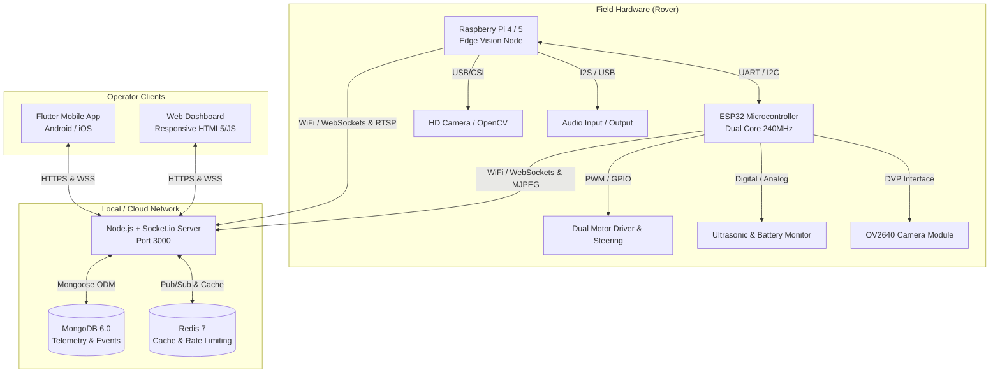

# System Architecture

The **Yahmi Security Rover** is an autonomous surveillance and robotics ecosystem combining embedded microcontrollers, edge artificial intelligence, cloud/on-premise orchestration, and cross-platform operator interfaces.

---

## 🏗️ Architecture Overview

---

## 🧩 Subsystem Details

### 1. Embedded Layer (`/esp32_firmware`)
- **Hardware Platform**: ESP32-WROVER or ESP32-CAM module.
- **Responsibilities**:
  - Direct motor actuation with PWM speed and direction control.
  - Sub-millisecond ultrasonic obstacle detection with automatic emergency stop.
  - Real-time battery voltage monitoring via calibrated ADC.
  - Embedded WebServer providing MJPEG camera stream on port 81 and WebSocket command receiver on port 82.

### 2. Edge Vision Layer (`/raspberry_pi_firmware`)
- **Hardware Platform**: Raspberry Pi 4 Model B (4GB/8GB) or Raspberry Pi 5.
- **Responsibilities**:
  - High-resolution video stream acquisition and compression.
  - Multi-threaded OpenCV computer vision pipeline (motion detection, facial recognition, bounding boxes).
  - Two-way duplex audio streaming (intercom capability).
  - Autonomous patrol route execution and fallback state handling.

### 3. Server & Central Hub (`/web_dashboard`)
- **Technology Stack**: Node.js, Express.js, Socket.io, Mongoose, Helmet.
- **Responsibilities**:
  - JWT authentication with secure session management and role-based access.
  - Low-latency WebSocket routing between control clients and rovers.
  - Telemetry ingestion, sensor history retention, and security alert dispatch.
  - Scheduled maintenance jobs for data cleanup and system diagnostics.

### 4. Database Layer (`/mongodb`)
- **Models**:
  - `User`: Operator credentials, roles, and failed login attempt lockouts.
  - `SystemStatus`: Rover connectivity, battery voltage, temperature, and operating modes.
  - `SensorData`: Periodic ultrasonic, IR, and environmental readings.
  - `AIDetection`: Timestamps, object classifications, confidence scores, and snapshot URLs.
  - `SecurityAlert`: Critical alerts generated from motion, intrusion, or perimeter trips.

### 5. Mobile Client (`/flutter_app`)
- **Technology Stack**: Dart, Flutter framework.
- **Responsibilities**:
  - Touch-based virtual joystick rover steering.
  - Live video stream display with low latency buffer.
  - Push notifications on critical security alerts.
